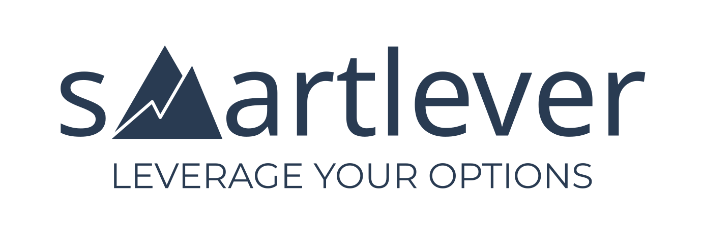
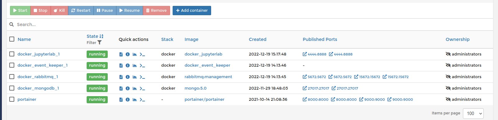
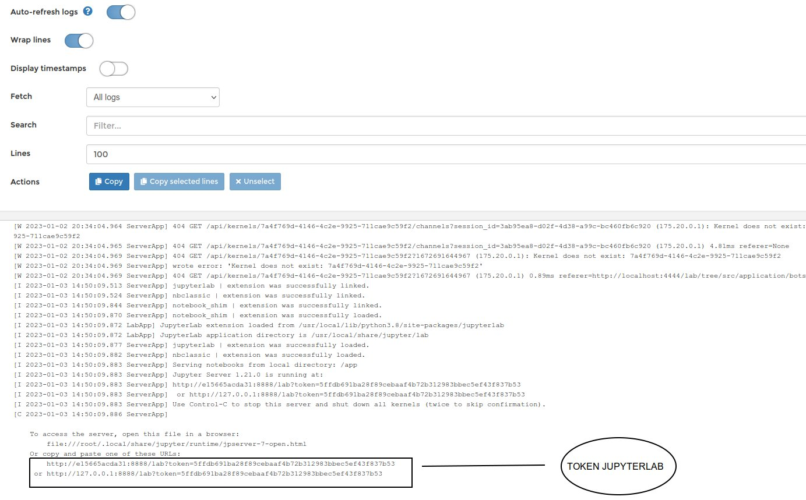
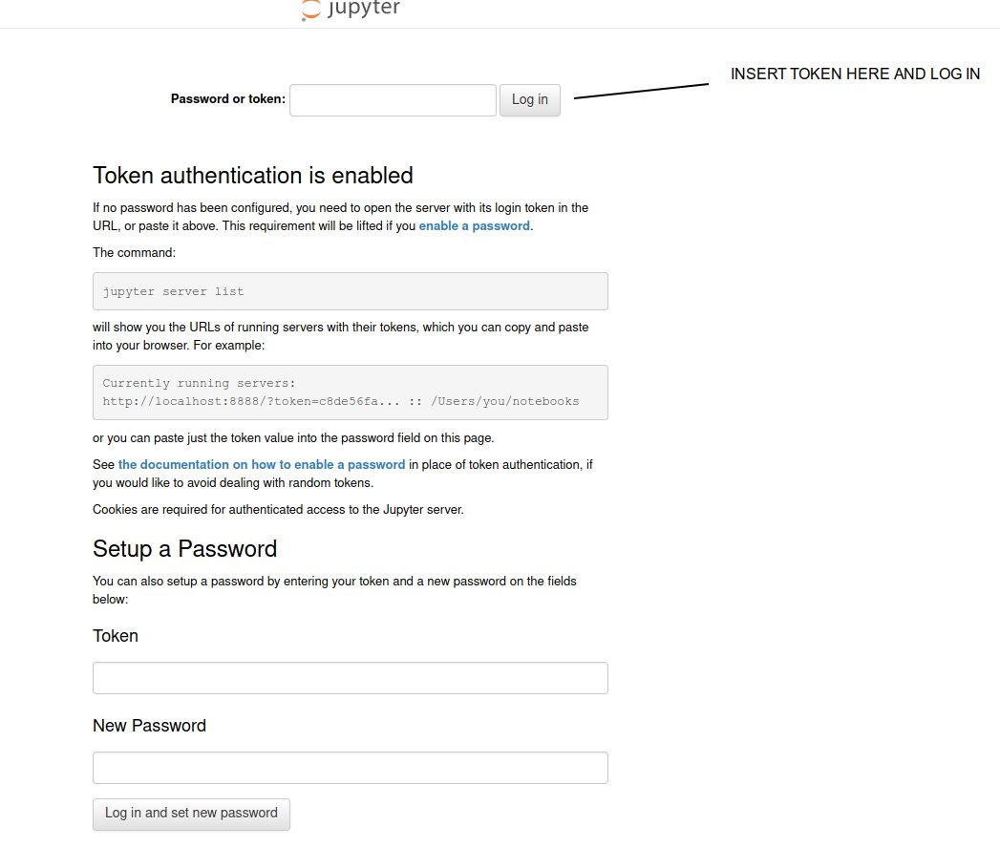
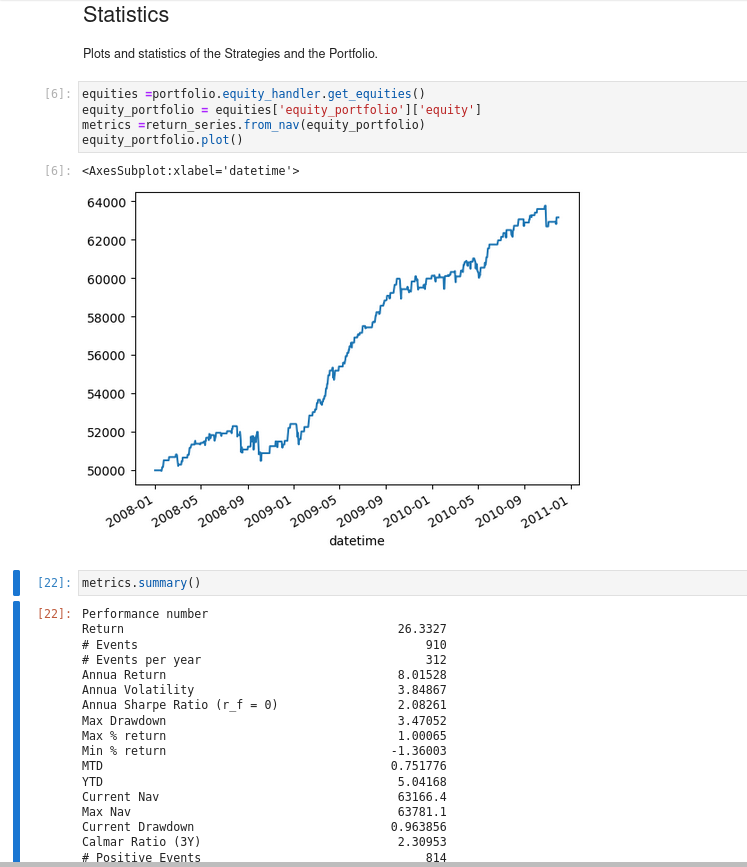
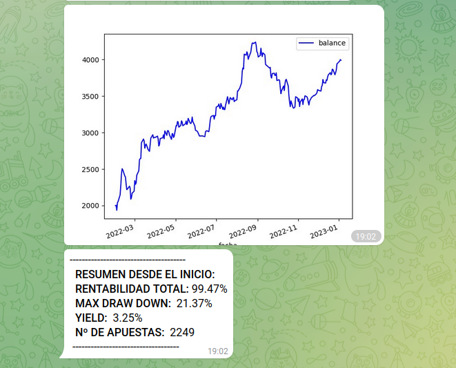

# SmartBots: An Event-Driven Platform

SmartBots is an event-driven platform that makes it easy to trade in cryptocurrencies, financial markets, and betting markets. The platform offers all the tools and architecture you need to build a trading bot, including backtesting and live trading capabilities.

Here is a fund that has been running on this platform for years: https://www.darwinex.com/es/invest/ZVQ

With SmartBots, you can quickly and easily test your trading ideas using backtesting, and then easily transition to live trading to monetize your strategies. The platform also provides monitoring tools to help you stay on top of your trades.

Overall, SmartBots is a comprehensive solution for anyone looking to build and manage their own trading bots.

Lets see how it works.

## Project Breakdown
```
SmartBots
├── src                              # folder for smartbots code
│   ├── application                  # folder for bots
│   ├── infrastructure               # folder for librery and helpers for trading
│   └── domain                       # folder for domain
├── docker                           # folder for docker files 
│   ├── docker-compose_basic.yml     # Configuration for basic components
│   ├── docker-compose_crypto.yml    # Configuration for trading a portfolio of cryptocurrencies
│   ├── docker-compose_betting.yml   # Configuration for trading a portfolio of betting
│   ├── docker-compose_financial.yml # Configuration for trading a portfolio of financial
│   ├── smartbot-python.dockerfile   # Docker file      
│   ├── compose.env                  # Configuration file for setting passwords and other variables
├── my_smartbots                     # folder with my own strategies, you should create it and put your strategies here
│   ├── my_betting_strategies        # folder with betting strategies
    ├── my_crypto_strategies         # folder with crypto strategies
    ├── my_financial_strategies      # folder with financial strategies
├── conf.env                         # Configuration file for setting passwords and other variables
├── requirements.txt                 # requirements for python


```

## Installation
1. Clone the Project

- Via HTTPS: `git clone https://github.com/SmartLever/SmartBots.git`
- via SSH: `git clone https://github.com/SmartLever/SmartBots.git`

2. Navigate into the project's folder

  ```bash
  cd SmartBots/
  ```

3. Easy install and running, with Docker-Compose. You do not need to have Python installed on your machine.
  All will be done on the container and configurations and modifications can be done with JupyterLab.

  Docker installation instructions, please refer to the [Docker-Compose](https://docs.docker.com/compose/install/) documentation.
  Once you have Docker-Compose installed, run the following command for lauching the basics service infrastructure:

  ```bash
  cd docker/
  docker compose -f docker-compose_basic.yml --env-file ./compose.env up -d
  ```
  Once running, you will have:
  - portainer: Service for managing dockers. Go to your_server_ip:9000 and enter in Docker Portainer, setup the password and you will enter in a Dashboard 
  where you can manage all the dockers. 
  
  - mongodb: Mongo database.
  - rabbitmq: service for MQ messages.
  - event_keeper: Service for keeping the events in the database.
  - jupyterlab: service for management the code. Get the Token going  to DashBoard in portainer,
  - localize the jupyterlab container and enter in logs console to copy the token.
    Navigate to your_server_ip:4444 and paste the token. That's all.
    
    

  Wellcome to SmartBots, you can now start coding and testing your strategies and run it in real time.

  Backtesting an Strategy Example:
  On jupyter Lab, go and open to src/application/bots/backtesting.ipynb and run the code.

  Live Trading, adapt docker/docker-compose_XXXXX.yml to your needs:
  ```bash
  cd docker/
  docker compose -f docker-compose_crypto.yml --env-file ./compose.env up -d
  ```

          

## Smartbots Financial 
SmartBots Financial is a feature of the SmartBots platform that allows users to create and automate financial trading strategies 
and apply them to various assets such as CFDs, forex, futures, and shares. 

In the current version of the platform the financial trading functionality is designed to work with brokers that offer the MetaTrader 4 platform, such as Darwinex.

To use the SmartBots Financial platform, users must first create an account with a broker that offers MetaTrader 4, such as Darwinex. Once you have an account, you can download and install MetaTrader 4 on your computer. Then, you can follow the instructions at the following URL to set up the platform and prepare it for use: https://github.com/paduel/MT_zeromq_vnc_docker.

Once you have set up the platform, you can use it to create and automate your financial trading strategies. You can use the platform in a test mode to simulate your strategies and evaluate their performance, or you can use it in live trading mode to execute your strategies and potentially make profits.

When we have mt4 running in docker and with the necessary ports open, we are ready to run docker compose with all services.
Also keep in mind to put all the variables necessary for the services work correctly
in the path docker/compose.env

Run this command:
 ```bash
 cd docker/
 docker compose -f docker-compose_financial.yml --env-file ./compose.env up -d
 ```
 
Inside the docker compose we have these services:

 * data_provider_mt4: This service connects to mt4 and generates minute bars of the symbols we want.
 * bot_financial_trading: This service executes the strategy and receives the bars that feed the strategy, 
   the configuration of the strategy is found in this location: src/application/bots/config_portfolios   /config_financial.yaml
 * broker_mt4: Receive the order and send the order to mt4, in addition to saving balance and active positions.
 * telegram_financial: For this service to work you must obtain a token by following the first part of this manual: https://www.pragnakalp.com/create-telegram-bot-using-python-tutorial-with-examples/ .
   Once you have the token you should put it in compose.env.
   With this service you will be able to control that the previous services work correctly, in addition to seeing the real and simulated positions.
   One of the advantages of this service is that if the positions do not match or any service fails, you will receive an alert.
 * update_mongodb_financial: Updates the library where we are saving the data historical, that is, we transfer the data that is being saved in the keeper library to the historical.

You can also simulate the simple_avg_cross as an example or any strategy you want to create. In path  src/application/bots/ there is a notebook called backtesting,
there you can download data, simulate and see a several of statistical ratios.

   

To download the data in this case from darwinex you need to have the credentials that darwinex provides you on its website in the
historical_ticks section, those credentials should be put in the docker/compose.env configuration file.

## Smartbots Crypto 
SmartBots Crypto is a feature of the SmartBots platform that allows users to create and automate  trading strategies 
and apply them with more than 115 exchages. 
Smartbots follows the implementation of ccxt, so you can use all the exchanges that ccxt supports.
Please, go to https://github.com/ccxt/ccxt/wiki/Manual#markets 

A short List:
* Binance
* Bitmex
* Bitfinex
* Bittrex
* Coinbase
* Coinbase Pro
.... and more.

Run this command for real-time:
 ```bash
 cd docker/
 docker compose -f docker-compose_crypto.yml --env-file ./compose.env up -d
 ```

## Smartbots Betting
SmartBots Betting is a feature of the SmartBots platform that allows users to automate their sports betting strategies on markets offered by Betfair. In order to use the betting platform, users must first create an account on Betfair and obtain the necessary keys and certificates. 

Detailed instructions for doing this can be found at the following URL: https://docs.developer.betfair.com/display/1smk3cen4v3lu3yomq5qye0ni.

Once you have your Betfair account and the necessary keys and certificates, you can use the SmartBots Betting platform to automate your sports betting strategies on Betfair markets. This can help you save time and effort, and potentially increase your profits by executing your strategies more efficiently.

 ```bash
 cd docker/
 docker compose -f docker-compose_betting.yml --env-file ./compose.env up -d
 ```
Your Username, Password and Keys should be put in path docker/compose.env and the certs file in src/infrastructure/betfair/certs/

The SmartBots Betting platform uses several Docker services to provide its functionality:

 * provider_betting: service connects with the Betfair broker to obtain data that will feed your betting strategies, as well as saving this data in a MongoDB database
 * bot_betting_trading: This service executes the strategy in this case, it is a very simple strategy, feel free to create your own strategy.
   The strategy configuration is found in this location: src/application/betting_trading/config_betting.yaml
 * broker_betting: service receives bets from your strategies and sends them to the Betfair broker, as well as managing pending bets.
 * telegram_betting: service allows you to control and monitor the other services using the Telegram messaging platform. You can obtain a Telegram token by following the instructions at the following URL: https://www.pragnakalp.com/create-telegram-bot-using-python-tutorial-with-examples/. Once you have the token, 
                     you can put it in the compose.env file and use the telegram_betting service to control and monitor the SmartBots Betting platform.

In addition to using the platform in a live trading environment, you can also use the backtesting_betting notebook in the bots/betting_trading directory to simulate and test your trading strategies using historical data. 
This can help you evaluate the performance of your strategies and fine-tune them before using them in live trading.

In the image below you can see the graph of a betting strategy that uses smartbots.



## Importants components:
### MongoDB docker: Historical data
MongoDB is used to store historical data, here more info: https://github.com/man-group/arctic
For large historical data it use as defaul months chunks, here docs: https://github.com/man-group/arctic/wiki/Chunkstore


## Other Info

### Subscribe to our news!
    https://smartlever.substack.com/

### Bugs
Please report any bugs or issues on the GitHub's Issues page.

### Disclaimer 
Trading in financial instruments involves high risks, including the risk of losing some or all of your investment amount. It may not be suitable for all investors. Before trading any financial instrument, it's important to be informed of the risks and costs involved. You should also be aware of your investment objectives and risk levels, as well as how much information you want in order to make a decision. That being said, I recommend that you seek out a professional so they can help you find the best outcome!. The data contained in the SmartBot library is not necessarily accurate. The SmartBot website and its provider will not be liable for any loss or damage as a result of using, or your reliance on the information contained therein.

### Contributing and Contact
If you would like to support the project, pull requests are welcome. You can contact us at andres@smartlever.tech


### Licensing 
**SmartBots** is distributed under the [**GNU GENERAL PUBLIC LICENSE**]. See the [LICENSE](/LICENSE) for more details.
